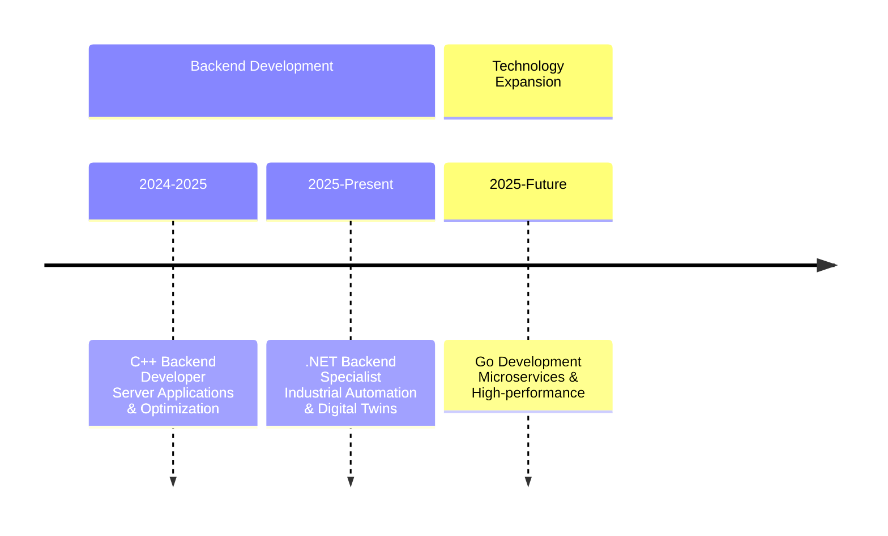

## 👋 Hello! I'm Alexey

### 💫 .NET & Go Developer

I'm a passionate Backend Developer who speaks both **C#** and **Go** fluently. I believe in using the right tool for the job - whether it's the robust ecosystem of .NET or the simplicity and performance of Go.

[//]: 

---

## 💻 Technology Stack

### **🏆 Core Expertise**

### **🚀 Actively Exploring**

### **🛠 Additional Skills**

---

## 🚀 Commercial Development Journey

## 💡 About Me
 
Experienced **.NET Backend Developer** with expertise in building robust enterprise solutions. Currently expanding my skillset by mastering **Go** for high-performance and concurrent systems. Passionate about clean architecture, best practices, and continuous learning.

**Key Strengths:**
- 🏭 Enterprise .NET development
- 🗄️ Database design and optimization  
- 🔧 System architecture and design patterns
- 🚀 Performance optimization
- 📚 Quick adoption of new technologies

---

**⭐️ From .NET to Go and everywhere in between**

